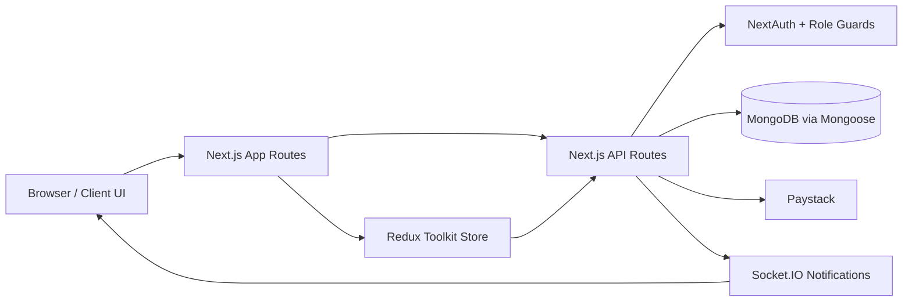
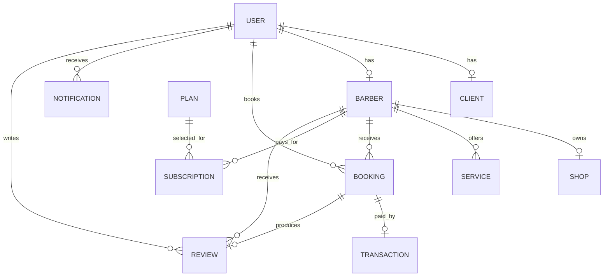
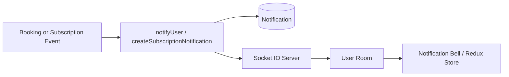
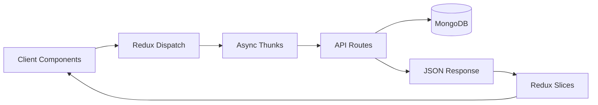

# BarbDegree Project Flow

This document maps how the BarbDegree Next.js app is connected. The diagrams use the same Mermaid flowchart style as `Cat_Diagram.md`.

## Project Layers



## Core Models



## Authentication And Role Routing

```mermaid
flowchart LR
  Visitor[Visitor] --> Login[/login]
  Login --> NextAuth[NextAuth Credentials or Google]
  NextAuth --> UserRecord[(User)]
  UserRecord --> HasRole{Role exists?}
  HasRole -->|No| Register[/register]
  Register --> SelectRole{client or barber}
  SelectRole --> RoleApi[/api/role]
  RoleApi --> ProfileForm[/register/client or /register/barber]
  HasRole -->|client| ClientDash[/dashboard/client]
  HasRole -->|barber| BarberDash[/dashboard/barber]
  HasRole -->|admin| AdminDash[/dashboard/admin]
  HasRole -->|superadmin| SuperDash[/dashboard/superadmin]
```

Role helpers:

- `src/lib/authOptions.ts` creates sessions and stores `user.id` and `user.role`.
- `middleware.ts` blocks `/dashboard/admin/*`, `/dashboard/superadmin/*`, and `/api/admin/*` before route handlers render or execute.
- `src/lib/authGuard.ts` protects API routes.
- `src/lib/roles.ts` defines `client`, `barber`, `admin`, and `superadmin`.
- `src/lib/adminAuth.ts` protects admin and superadmin dashboard pages server-side.
- `src/lib/adminApi.ts` protects admin API routes.

## Client Booking Flow

```mermaid
flowchart LR
  Client[Client Dashboard] --> FindBarber[/barbers/:id]
  FindBarber --> Services[/api/services?barberId=...]
  Services --> Book[/book or /book/confirm]
  Book --> CreateBooking[/api/bookings POST]
  CreateBooking --> Booking[(Booking)]
  Booking --> NotifyBarber[Notify Barber]
  NotifyBarber --> Socket[Socket.IO]
  Booking --> Checkout[/checkout/:bookingId]
  Checkout --> PaystackInit[/api/paystack POST]
  PaystackInit --> Paystack[Paystack Checkout]
  Paystack --> Verify[/api/paystack/verify]
  Verify --> Transaction[(Transaction)]
  Verify --> PaidBooking[Booking paymentStatus paid]
  PaidBooking --> Receipt[/api/receipt/:id]
```

Important booking rules:

- Clients can create bookings only for active, subscribed barbers.
- Bookings calculate price from selected `Service` records.
- Duplicate active timeslots for the same barber are rejected.
- Admins can read all bookings through `/api/admin/bookings`.

## Barber Operations Flow

```mermaid
flowchart LR
  Barber[Barber Dashboard] --> Profile[/dashboard/barber/profile]
  Barber --> ServicesPage[/dashboard/barber/services]
  ServicesPage --> ServicesApi[/api/services]
  ServicesApi --> Service[(Service)]
  Barber --> BookingQueue[/dashboard/barber/bookings]
  BookingQueue --> Accept[/api/bookings/:id/accept]
  BookingQueue --> Decline[/api/bookings/:id/decline]
  Accept --> ClientNotify[Notify Client]
  Decline --> ClientNotify
```

Barbers manage:

- Profile, location, contact, and shop data.
- Services and prices.
- Booking acceptance or decline.
- Subscription status before receiving paid bookings.

## Subscription Flow

```mermaid
flowchart LR
  Barber[Barber] --> Plans[/api/subscription/plans]
  Plans --> Subscribe[/api/subscriptions/initialize]
  Subscribe --> Paystack[Paystack Subscription]
  Paystack --> Verify[/api/subscriptions/verify]
  Verify --> Subscription[(Subscription)]
  Verify --> BarberStatus[Barber subscriptionActive]
  Paystack --> Webhook[/api/paystack/webhook]
  Webhook --> SubscriptionStatus[Update subscription status]
  Admin[Admin] --> Override[/api/admin/subscriptions/toggle-status]
  Override --> BarberStatus
```

Subscription data connects:

- `Plan` defines subscription products.
- `Subscription` tracks Paystack references and lifecycle.
- `Barber` stores active subscription state and admin override state.
- Admins can view history at `/dashboard/admin/subscriptions`.
- Admins can create and activate/deactivate plans at `/dashboard/admin/plans`.

## Reviews And Reputation Flow

```mermaid
flowchart LR
  PaidBooking[Paid Confirmed Booking] --> ReviewForm[Client Review]
  ReviewForm --> ReviewsApi[/api/reviews POST]
  ReviewsApi --> Review[(Review)]
  Review --> CompleteBooking[Booking status completed]
  Review --> Leaderboard[/api/barbers/leaderboard]
  Leaderboard --> ReputationEngine[BarberReputationEngine]
  ReputationEngine --> RankedBarbers[Ranked Barbers]
```

Review rules:

- Only clients can review.
- A review must belong to a paid and confirmed booking.
- Each booking can produce one review.
- Reputation uses reviews, completed jobs, consistency, cancellation rate, and recent performance.

## Admin Access Flow

```mermaid
flowchart LR
  AdminLogin[Admin or Superadmin Session] --> AdminGuard{Admin role?}
  AdminGuard -->|No| DashboardRedirect[/dashboard]
  AdminGuard -->|Yes| AdminLayout[/dashboard/admin layout]
  AdminLayout --> Overview[/dashboard/admin]
  AdminLayout --> Users[/dashboard/admin/users]
  AdminLayout --> Barbers[/dashboard/admin/barbers]
  AdminLayout --> Clients[/dashboard/admin/clients]
  AdminLayout --> Bookings[/dashboard/admin/bookings]
  AdminLayout --> Services[/dashboard/admin/services]
  AdminLayout --> Transactions[/dashboard/admin/transactions]
  AdminLayout --> Subscriptions[/dashboard/admin/subscriptions]
  AdminLayout --> Plans[/dashboard/admin/plans]
  AdminLayout --> Reviews[/dashboard/admin/reviews]
```

Admin API routes:

- `/api/admin/dashboard` aggregates platform stats.
- `/api/admin/users` lists users and profile state.
- `/api/admin/users/:id` updates roles.
- `/api/admin/barbers` lists barber profiles with counts.
- `/api/admin/clients` lists client profiles with booking spend.
- `/api/admin/bookings` lists all bookings with filters.
- `/api/admin/services` lists all services with barber ownership.
- `/api/admin/transactions` lists payment and subscription transactions.
- `/api/admin/subscriptions` lists subscription records.
- `/api/admin/subscriptions/toggle-status` controls barber access overrides.
- `/api/admin/plans` lists all plans.
- `/api/admin/plans/:id` activates or deactivates plans.
- `/api/admin/reviews` lists reviews.

Admin role boundaries:

- `admin` can manage client and barber roles, profiles, bookings, subscriptions, services, transactions, plans, and reviews.
- `superadmin` can do everything admin can do and can also move users into or out of `admin` and `superadmin` roles.
- Admin APIs reject unauthenticated users with `401` and non-admin users with `403`.

## Notification Flow



Notifications are initialized in `src/components/Providers.tsx`. Once a user session is available, the app loads notifications, fetches the current user, connects to Socket.IO, and joins a room for the authenticated user id.

## Frontend State Flow



Redux slices:

- `servicesSlice` handles barber/admin service lists and mutations.
- `bookingsSlice` handles booking lists and booking updates.
- `transactionsSlice` handles user transaction history.
- `notificationsSlice` handles notification loading and read state.
- `subscriptionSlice` handles barber subscription state.
- `adminBarbersSlice` handles admin barber subscription overrides.
- `userSlice` hydrates the current user profile.

## Route Map

Public and shared routes:

- `/` landing/home search experience.
- `/barbers/:id` barber profile and services.
- `/book`, `/book/confirm`, `/checkout/:bookingId` booking and payment flow.
- `/login`, `/register`, `/register/client`, `/register/barber`, `/auth/redirect`.

Client routes:

- `/dashboard/client`
- `/dashboard/client/profile`
- `/bookings`
- `/bookings/:id`
- `/transactions`

Barber routes:

- `/dashboard/barber`
- `/dashboard/barber/profile`
- `/dashboard/barber/bookings`
- `/dashboard/barber/services`
- `/dashboard/barber/services/add`

Admin routes:

- `/dashboard/admin`
- `/dashboard/admin/users`
- `/dashboard/admin/barbers`
- `/dashboard/admin/clients`
- `/dashboard/admin/bookings`
- `/dashboard/admin/services`
- `/dashboard/admin/transactions`
- `/dashboard/admin/subscriptions`
- `/dashboard/admin/plans`
- `/dashboard/admin/reviews`

Superadmin route:

- `/dashboard/superadmin`

## End-To-End Flow Summary

```mermaid
flowchart LR
  User[User] --> Auth{Authenticated?}
  Auth -->|No| Login[/login]
  Auth -->|Yes| Role{Role}
  Role -->|client| ClientFlow[Find barber, book, pay, review]
  Role -->|barber| BarberFlow[Manage profile, services, bookings, subscription]
  Role -->|admin| AdminFlow[Manage platform records and operations]
  Role -->|superadmin| SuperFlow[Admin operations plus admin-level role control]
  ClientFlow --> Data[(MongoDB)]
  BarberFlow --> Data
  AdminFlow --> Data
  SuperFlow --> Data
  Data --> Notifications[Notifications and dashboards]
```
